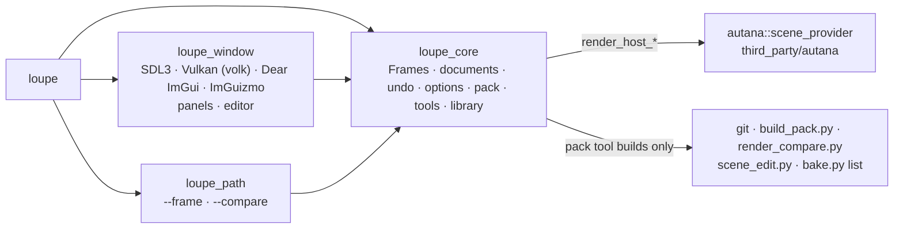

# Architecture

```mermaid
flowchart LR
  cli["loupe"] --> window["loupe_window<br/>SDL3 · Vulkan (volk) · Dear ImGui · ImGuizmo<br/>panels · editor"]
  cli --> path["loupe_path<br/>--frame · --compare"]
  cli --> core
  window --> core
  path --> core
  core["loupe_core<br/>Frames · documents · undo · options · pack · tools · library"]
  core -- "render_host_*" --> autana["autana::scene_provider<br/>third_party/autana"]
  core -- "pack tool builds only" --> tools["git · build_pack.py · render_compare.py<br/>scene_edit.py · bake.py list"]
```

The [architecture explorer](https://jose-villegas.github.io/loupe/) draws every module
and include from the sources, rebuilt on each push to `main`.
